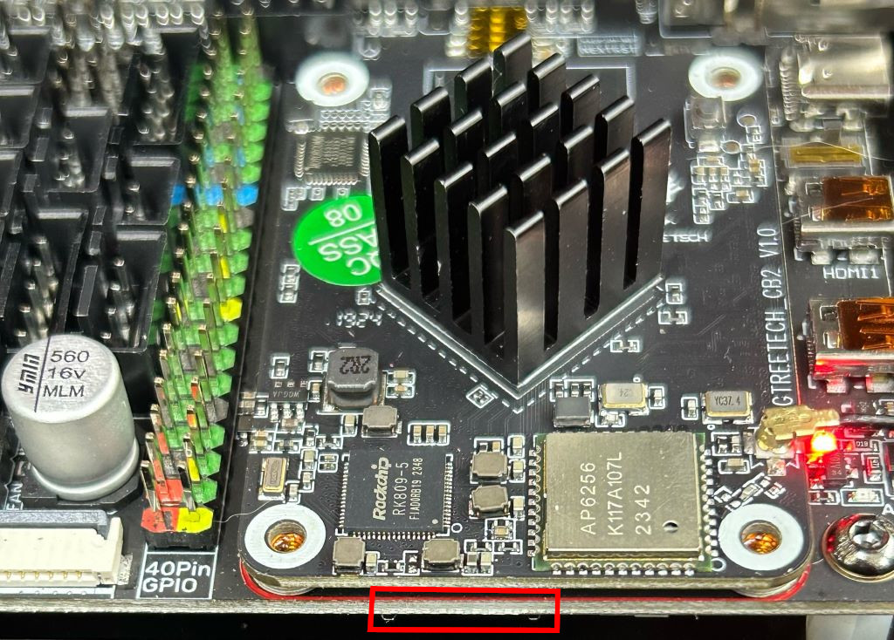

# Software Install: Basics

## First power-on

I did one last check with a multimeter to make sure all the wires were connected how I expected via the included wiring diagram and then turned it on.  None of the magic smoke escaped, and it booted into Klipper.  However, it didn't have a config included so it didn't fully start.

## Reflash the Boards

I wanted to start from fresh, even though all boards come pre-flashed from Siboor.  

### CB2

Most of my info comes from the [BTT Wiki](https://bttwiki.com/CB2.html).

I am using the BTT CB2 that came with the kit, so I grabbed the minimal Armbian image (without Klipper) from [BTT](https://github.com/bigtreetech/CB2/releases). I pre-loaded the SD card with my wifi credentials and the same `armbianEnv.txt` and `system.cfg` values from the pre-flashed install.

The SD Card slot that controls the CB2 is on the underside of the manta beneath the CB2 itself, which is awkward to reach if the cable channels are installed. I removed the screws from the cable channel so I could move it out of the way and slip the flashed SD Card inside.  

Once booted from SD card, I copied it to the onboard eMMC to make it permanent with `sudo nand-sata-install` (Instructions from [the wiki](https://bttwiki.com/CB2.html#writing-system-onto-emmc-using-a-microsd-card)).

I now have a clean install of armbian with nothing of note on the system.  I installed my config management system on the CB2 and set up two users: one for running klipper (named `trident`) and another for my configuration management system to SSH in and modify the system with. This setup is my own personal preference way of doing these things and not actually needed for it to function.  I'm going to elide most of the config-management side of things because it doesn't actually matter and is just for my convenience of developing and versioning configs for the entire machine.

Next up was [KIAUH](https://github.com/dw-0/kiauh) to manage klipper installs and such.  I installed Klipper, Moonraker, KlipperScreen, and Mainsail this way. 

I grabbed a base klipper config from Siboor from their [repo](https://github.com/Lzhikai/SIBOOR-Voron-Trident-June/tree/main/Configure/Printer.cfg), and also incorporated many of the bits from Fragmon's config [here](https://github.com/cryd-s/siboor_trident).  I'll go into the klipper config more later but these work as bases to start from.

### MCU and SB2209 Flashing

Next up was installing katapult on the MCU and SB2209.  For these, I won't reproduce the steps but I followed everything from Esoterical's great [CANBus Guide](https://canbus.esoterical.online/Getting_Started.html).  The only thing to note for the CB2 is that it uses `ifupdown` for `can0`, so follow those instructions instead of the netplan ones.

Make sure to stop at all the stop signs and actually verify the output, I've helped several people on the Voron discord with canbus issues that stemmed from not having an underlying step working correctly before moving forward.

The one trick with using canbus is that we need to figure out what the UUIDs are for each of the three CAN devices: the MCU, the SB2209 toolhead board, and the Cartographer probe. 

To figure out the MCU, I disconnected the CAN wire from the mainboard and flashed it according to the guide.  Since it's the only component connected, when I run the canbus query, it's the only thing that responds and I can note its UUID.

The toolhead flashing process has you boot it into DFU mode and flash via USB cable, which went smoothly (besides the finnicky tiny jumper that needed to go on to draw power via the USB 5v).  This has an upside: when you're done and you reconnect all CAN wires, when you do the canbus query you will see 3 items: The MCU UUID that you already know (reporting that its running Klipper), and two unknown UUIDs.  However, since we just flashed the toolhead board with Katapult, it's reporting that its running Katapult, while the cartographer reports running Klipper, making it easy to determine which component is which.

With all the UUIDs resolved, I finished flashing the toolhead.  I skipped flashing the cartographer because it seems to be fine for now, and because I'd have to download a fork of Katapult to do it because it doesn't currently support the MCU on the carto board.

