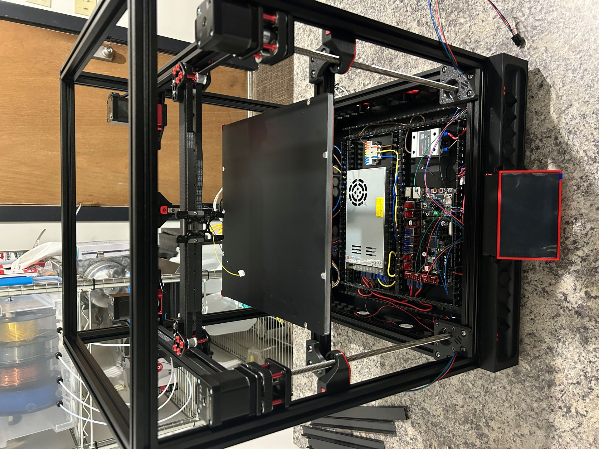

# Bed

Time: 1 Hour

First up was prepping the aluminum plate and applying the magnetic sheet and bed heater pad.  I prepped both sides with isopropyl alcohol to remove any surface gunk and fingerprints, then applied the magnetic sticker.  Between the sheet alignment tabs and the thick magnetic sheet, it was easy to apply to the plate without bubbles.  I used a piece of the 2020 extrusion to smooth out the application.

Once the bed was prepped, I assembled the bed frame and connections between the Z-carriage and the bed frame and then attached the bed.  The bed on this kit sits on bakelite isolation spacers instead of on metal thumbscrews in order to isolate the bed from the frame and limit heat transfer.

