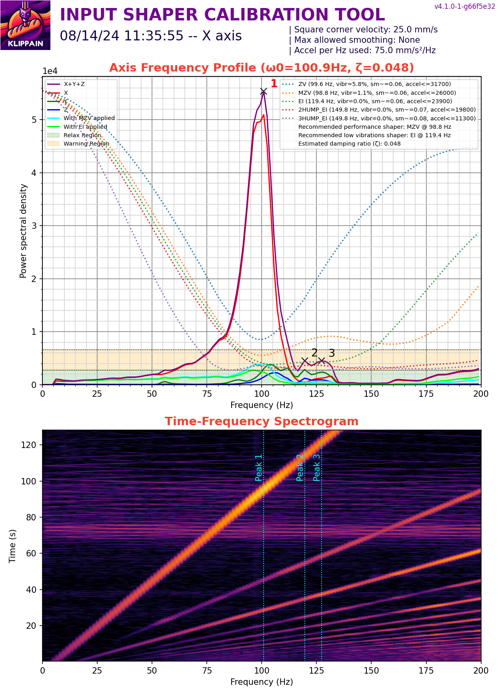
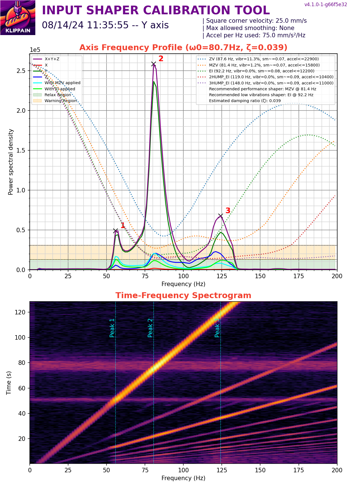
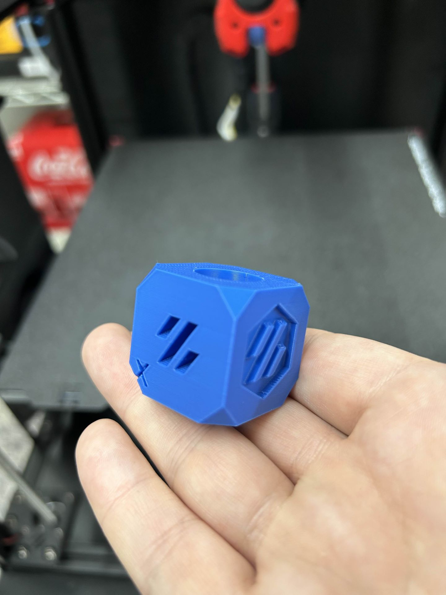

# Calibration Steps

As of writing this, there isn't a good singular source for calibrating this printer.  Siboor is working on their [docs site](https://docs.siboor.com/siboor-trident-june) but it currently does not go any further than initial startup checks and slicer setup.

## Mechanical Checks

### Steppers

Here, I followed the [Voron official startup guide](https://docs.vorondesign.com/build/startup/). I went through and verified the hotend and bed responded to requests for heating (but not at full temp yet), and then tested all the fans.  From my config, I even switched them all to `fan_generic` for a while so I could mess with cycle time and max power without having to trigger their on conditions.

Next up was the stepper motor check, and I made a mistake in this part.  I followed the official guide to buzz all the steppers and verify their rotation direction, but an official Voron Trident only has 2 XY motors.  I completely neglected to buzz `stepper_x1` and `stepper_y1`, and also didn't fully grasp what the buzzing was doing. 

The stepper buzz disables all other motors so they spin freely, while turning whichever stepper you specify, first clockwise (looking from the top) then back counter-clockwise. Since I neglected to buzz my back motors, I didn't fully realize that I had wired the motors to the mainboard wrong.  I had swapped the ports for X1 and Y1, as X0/X1 and Y0/Y1 are diagonal from each other and I wired them front-back.  

The first time I told it to Home (after checking endstops), it tried to shudder itself apart as the motors fought each other.  Luckily, I was primed over the E-stop button.

Disconnecting the front motors and attempting to buzz immediately made it clear what I had done, so I put everything back together and buzzed it correctly.

### Endstops

Still following the Official guide, I checked all the endstops by manually triggering them and using `QUERY_ENDSTOPS`.  Since I'm using the Cartographer for my Z endstop, I instead put a metal object near the sensor to confirm that it triggered with room to spare for the nozzle.

### PID Tuning the hotend and bed

This went according to [the guide](https://docs.vorondesign.com/build/startup/#pid-tune-bed--hotend), and I saved the found values in the config.

### Cartographer Calibration

Here I switched over to the [Cartographer docs](https://docs.cartographer3d.com/cartographer-probe/installation-and-setup/cartographer-with-input-shaper-v2-and-v3-hybrid) to calibrate the cartographer.

### Z-Tilt

I then ran a Z-tilt and a bed mesh.  This revealed a frame alignment issue on the Y-extrusions.  The front of the mesh was level, but the back corners were low and high, respectively.  I'm going to just quote **Thor** from the Voron discord here for the fix:

```
Fixing a Wonky Trident Bed Mesh

Y extrusions that are not in plane with each other result in an odd mesh.  It will appear straight accross the front of the bed and the back will have a slant.

This is because a trident only levels the bed from 3 points near the z drives so it does not have the means to correct z height in the back corners. 
 
Before making any adjustments place printer in its permanent location and ensure the surface it's on is flat and solid.


The fix is to adjust one corner on one Y extrusion to compensate. With a mesh active, hover over the two back corner points and see the difference in Z height between them. The difference between them is the amount you need to move a corner by.


One side on the back of the mesh will be red.  (It will look like the bed is too high in that area)  On the side that is red you will adjust the front corner down by the amount you measured earlier in the mesh. This is done by loosening the screw for the blind joint on the front of the printer in the vertical extrusion. Move that side of the Y extrusion down. 

Leave the printer powered and leveled while making these adjustments so you can quickly run a Z-Tilt and a bed mesh and see if further adjustment is required.
```

An extra note that I needed: "Y extrusion" here refers to the 2020 extrusion that the Y linear rails are attached to, or the extrusions that are in the middle of the frame.

### E-steps

I verified the E-steps for the extruder, which ended up to be already correct from the upstream config.

## Input Shaping

I ran Shake&Tune to look for any sort of looseness issues and to find my max accel and input shaper settings.  I got fairly decent results off the bat, so I'm not planning on chasing unicorns just yet. 





The peak at 55hz on the Y graph seems to be caused by the drag chain mount on the back side of the toolhead.

Input Shaping is its own giant rabbit hole, so I'd start at the [Readme](https://github.com/Frix-x/klippain-shaketune/blob/main/docs/README.md) for Shake&Tune and go from there. For me, I'm happy with the speed, results, and quality.

## Print Tuning

With the mechanical checks out of the way, I moved on to [Ellis' Print Tuning Guide](https://ellis3dp.com/Print-Tuning-Guide/articles/index_tuning.html).

I went through Z-Offset tuning, Pressure Advance/Linear Advance, and Extrusion Multiplier tests and picked out values that I liked.

I skipped the other tests for now, if I want to chase max flow or the like I can come back to those later.

## Slicer Tuning

I started with [Crydteam's Orca Slicer Profile](https://github.com/cryd-s/siboor_trident/blob/main/Orca_Profile.3mf) and copied the settings into my own profiles, and updated my max accels from the input shaper results.  

I've recompiled these into an `.orca_printer` archive [here](slicer/Siboor%20AWD%20Trident.orca_printer) for easier importing, the only thing that needs to be set is the bed shape via [these instructions](https://docs.siboor.com/siboor-trident-june/3the-build/slicer-setup#set-bed-shape).

