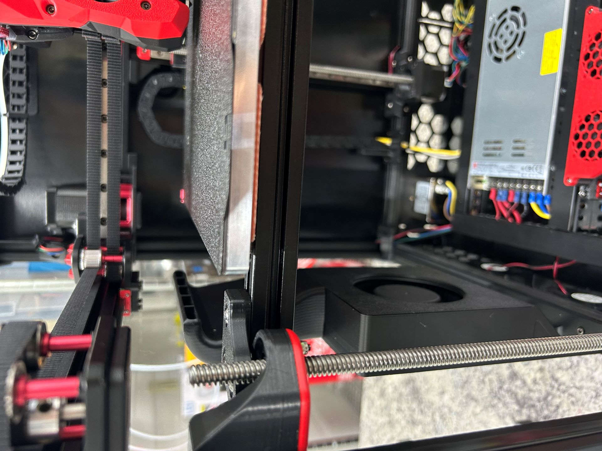

# Finishing Assembly

_Alternate title: The Rest of the Owl_

Duration: 6 hours

After the toolhead, there were a few more odds and ends and mods that needed to be added

## Extra Fans

There's 3 extra fans in this kit: A fan for the stepper drivers, a side skirt fan for extra part cooling, and a recirculating fan with a carbon filter to remove VOCs when printing stinky things like ABS or ASA.

### Stepper Fans

This one was pretty straightforward but the wiring and JST connector were not long enough to reach the MCU board.  I made an extension cable so that there's plenty of slack.

### Side Skirt Fan

This one was also straightforward and I had to do no improvisation to get everything to fit.

### Fume Pack Recirculating Fan

Assembly of the fume pack was easy enough but I ran into a couple issues that I had to improvise my way around.  

The first was that the back panel where this mounts was missing a drilled hole for one of the screws.  I scored the panel with some calipers after measuring where the screw hole should be, and then drilled it out.

The second was that the pneumatic connector that fits into the fume pack can't do its job as advertised, as this connector is supposed to have PTFE tubing pass all the way through it from the outside spool holder to the toolhead to deliver filament.  The inside of the connector has a plastic stopper to stop tubing from being shoved too far in, so the tubing can't get inside the enclosure.  There's also nothing on the back side of the connector to grip tubing, so you can't use a separate piece of tubing for the run from the fume pack to the tool head.

## Reinforcements

This kit includes diagonal frame braces and backing strips to reinforce the XY gantry. These went on smoothly and should increase rigidity both when moving and while heating.

## Clickyclacky Door

This mod adds a nice solid door to the printer, with 4 extra 2020 extrusions and an acryllic panel captured inside.  This mod was a colossal pain in the butt. 

First issue, there are pins and bushings that are meant to be inserted into printed parts to form the hinges both for the door and for the latch.  The printed parts with the kit were too narrow to insert the bushings, and I broke one trying to get it in.  There are no extras of the bushings, unlike many of the other components in this kit. 

In order to resolve the snugness, I drilled out the holes for the bushings.  This turned out to be slightly _too_ big, so I wrapped the bushings in a layer of tape for a friction fit.  Each door hinge is supposed to have two bushings each (2 hinges total, top and bottom), so one of my hinges is missing a bushing.  It doesn't seem to affect the function, so I'm going to call it Solved Forever.

Final issue was that the assembly instructions called for 1mm thick foam tape around the door to seal, but this is way too thin and left gaps.  I removed it and went with 3mm instead and it is a much nicer fit.

Overall, I like this mod but I would do several things differently if I were to ever do this again.

## Finishing and Panels

Last bit was adding covers to the grooves in the 2020 extrusions to cover up wiring, and then adding on the side panels.  I also took the opportunity to double-check belt paths and pulleys, and had to adjust the pulleys on the motors slightly to make sure they were in line with the belt paths.  Since this is an AWD setup, I also tried to manually sync the motors so that the belts and pulleys were well-seated on the motors.

## Complete!

Everything's now assembled, I'm going to go over wiring one more time and then attempt to turn it on.  Assuming the magic smoke stays on the inside, it will be time to start installing software and tuning the hardware.

