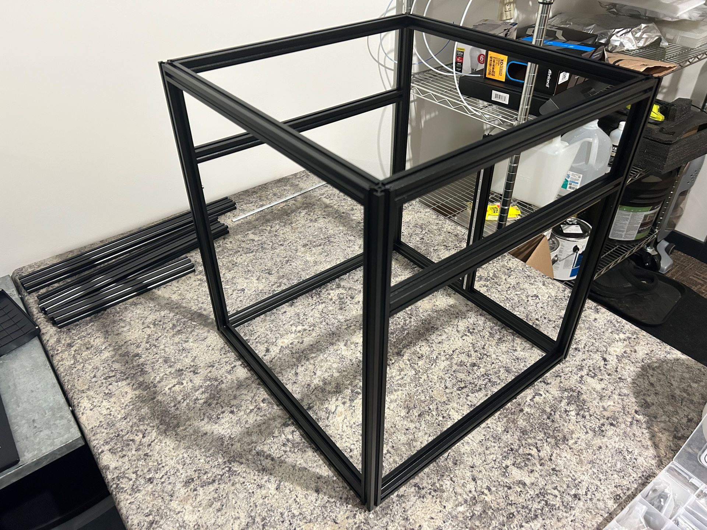

# Frame assembly

Time: 1.5 hrs

Frame went together smoothly with blue Loctite, using a machinist's square. I nearly thought I had it all skewed because it wasn't sitting square on my work surface, but I moved it to another bench and realized that my piece of laminate is just warped.  Confirmed it was square by measuring all diagonals.

