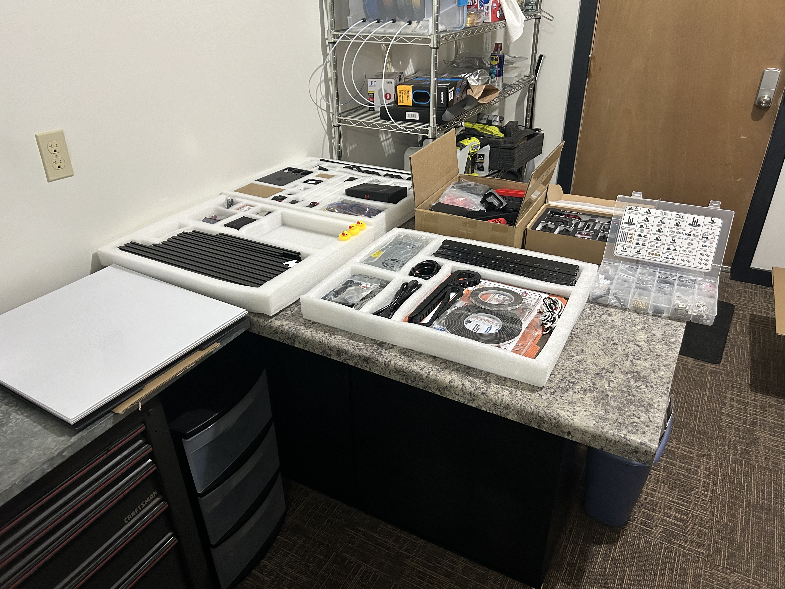

# Intro and Unboxing

## About Me

I've been tinkering with 3D printers for 3 years now, and have owned and repaired several bedslingers.  My daily driver is an Ender 3 Pro with very few stock parts left, running custom Marlin firmware.  I'm a programmer by trade and do embedded programming for hobby projects.  This is my first Voron.

## Unboxing

It came in one ~50lb box.  Everything was packaged very well and I appreciate the hardware organizer for all the screws and bits (and also that they included the BTT duckies!)

## Issues found

It was quickly discovered on the Siboor Discord that there were a few oversights in the first few units delivered:

1. BOM quantity of the 6mm foam tape was 2, only 1 made it in the box
2. Included part for mounting the power plug was wrong dimensions
3. Some M5 flange nuts were out of spec and did not grip M5 bolts

My kit did not suffer from #3, as tested with some included M5 bolts.  However, I'd note that they seem of rather low quality.  I'm going to see what they're for and potentially replace these if they're for some critical piece (this might be foreshadowing).

