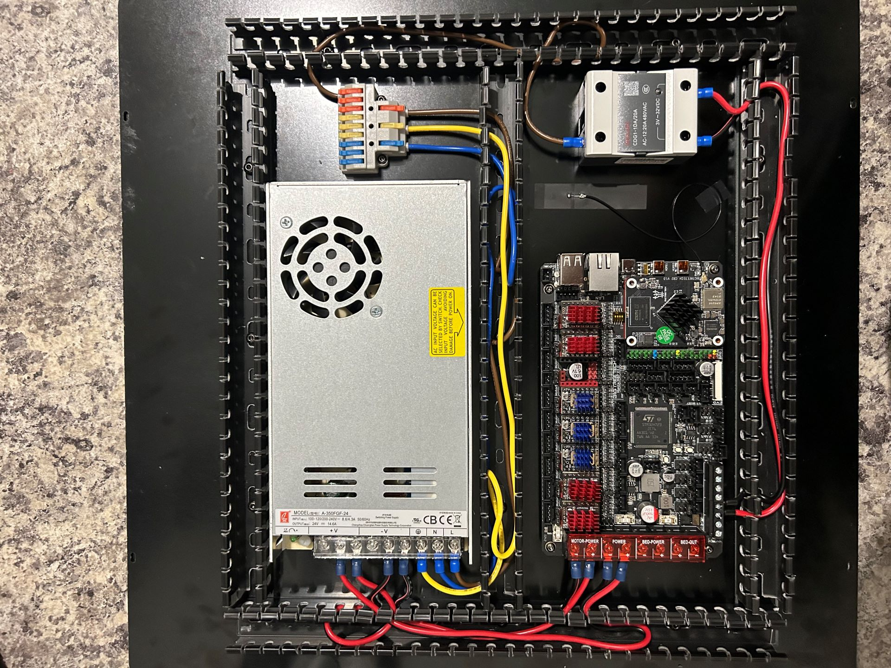
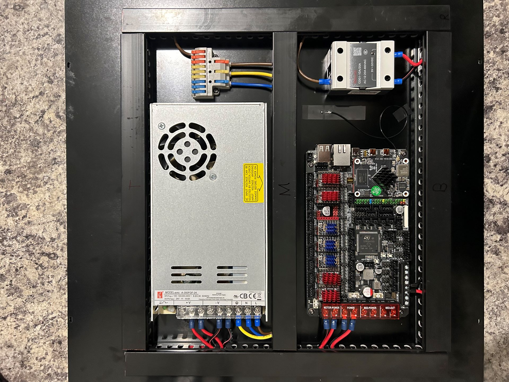
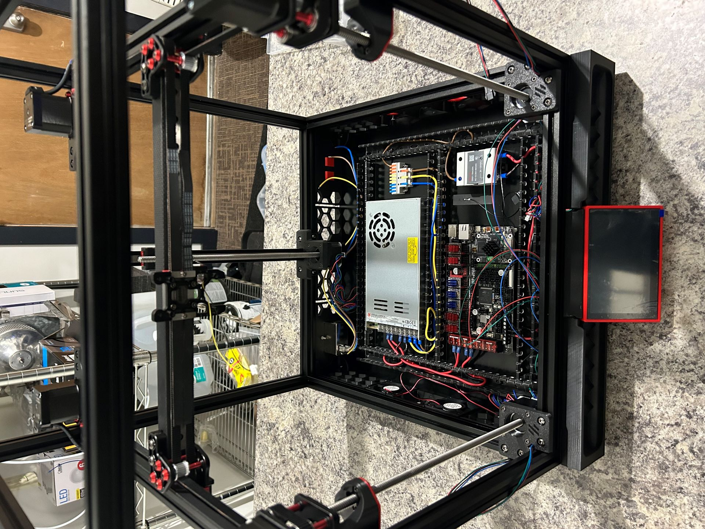

# Skirts and Electronics Bay

Duration: 3.5 hours

Next was installing the side skirts and the bottom plate which mounts all the electronics.  The skirts and side fans went together quickly, and then I set about setting up the electronics bay.  I decided to do as much of the wiring as I could at this point while it was out of the machine for easy access.

I replaced the ends on the wire that runs from the MCU to the relay.  The relay end was forks but the other end was just tinned wire, and it is meant to screw into a terminal block on the MCU.  I replaced the tinned ends with ferrules, 16awg just barely fit onto the wires and into the terminal block. It was also a tight fit between the cable management looms and the MCU, so I had to remove the bottom loom to get the wires in and then replace it.

After wiring as much as I could, I installed the baseplate on the bottom of the printer and added the rubber feet. 

