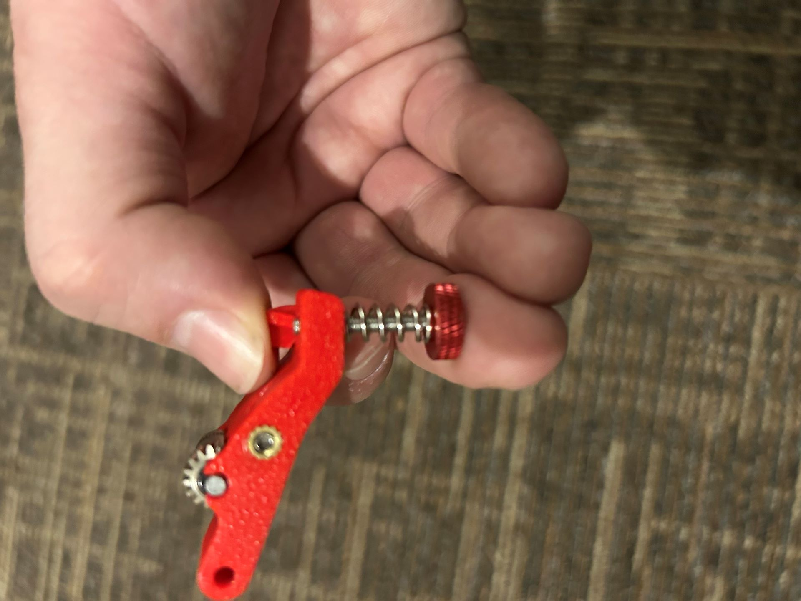
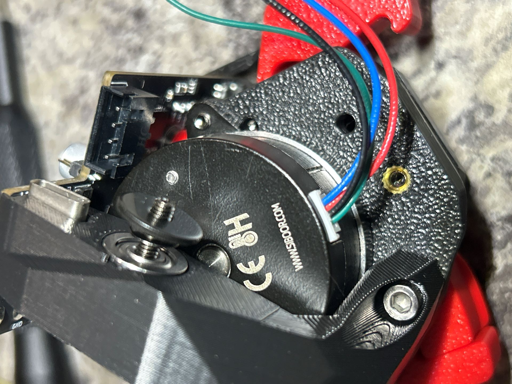
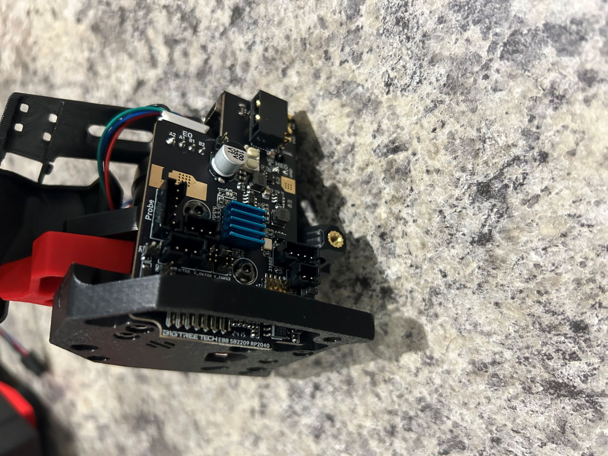
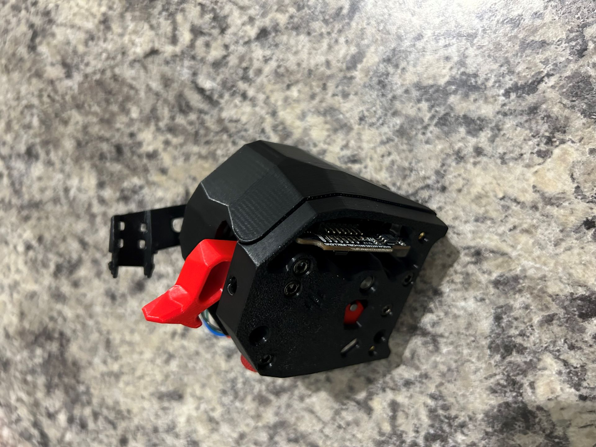
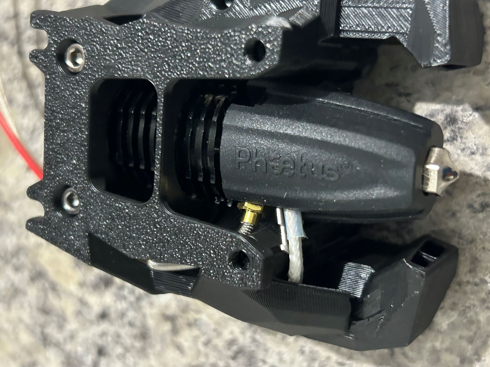
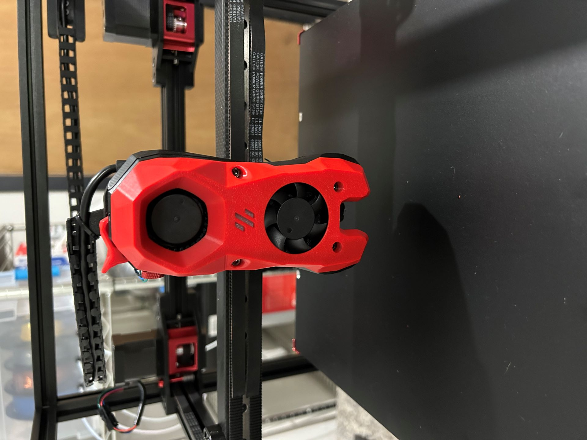

# Stealthburner Toolhead

Duration: 3 hours

I'm starting out with the stock Voron toolhead, the Stealthburner.  I may try the Xol at some point, which is compatible with the CNC carriage from this kit.

## Clockwork 2 Extruder

This went together pretty well, though this is the first time I've had to improvise a fix for something in the kit. The included spring for the filament tensioner turned out to be too long, and I had to cut down a spring to the correct length. The below picture shows that the thumbscrew with the spring from kit barely pokes past and won't really grip any threads, and if I actually tightened it down enough to fit, it would deathgrip any filament running through the extruder.

I got a new #2 spring at the hardware store and cut it down to size (12mm according to the Voron documentation) and that works much better. I could have clipped the spring that came with the kit, but I was concerned about messing that up and being left with no spring at all, and $0.75 was a small price to pay for that insurance and enough spring to make 2 more toolheads.

I can now adjust the tension between "It doesn't grip the filament at all" and "deathgrip" successfully.  I also adjusted the anti-squish-thingamajig (the technical term) to make sure that the gears are meshing well.

The second problem I had to improvise around was the drag chain bracket.  This is meant to swivel freely so that the drag chain doesn't get stuck or impede the toolhead's movement, but as shown would either bind up or would be so loose as to rattle around.  It included two bearings and a bolt in a stack, but that was going straight into a printed part so there was print-to-print contact between the extruder and the arm.  I added a couple washers as shown below to engage the bearings alone and raise the arm up enough that the printed parts no longer interfered.  After that I could tighten it appropriately and still get smooth travel from the bracket.

Those problems sorted, the rest of it came together well and I calibrated it with some scrap filament.

## Hotend

The hotend went together with fewer issues.  I'm using a Rapido v2 UHF so I had to disassemble the hotend first to rotate the nozzle with respect to the heatbreak for wiring reasons.  I also added the UHF adapter and silicone sock.  The only issue I ran into was having to clip the ziptie that held the heater cartridge to a small bracket in order to route the wires inside the printed fan ducts, but the printed part itself should be sufficient to hold the wires in the right spot.

## Installation

Wiring the fans and PCBs was straightforward enough, if a bit cramped.  A couple times, I had to disassemble in order to play with wire routing to make sure I both had enough room to connect things, but also have a plan for where the wires would rest so that the cover would go on.  I added some small strips of electric tape to hold some of the fan/LED wires in place and out of the way.

