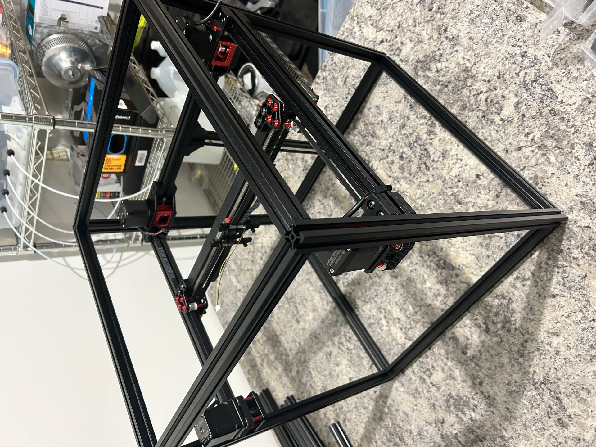
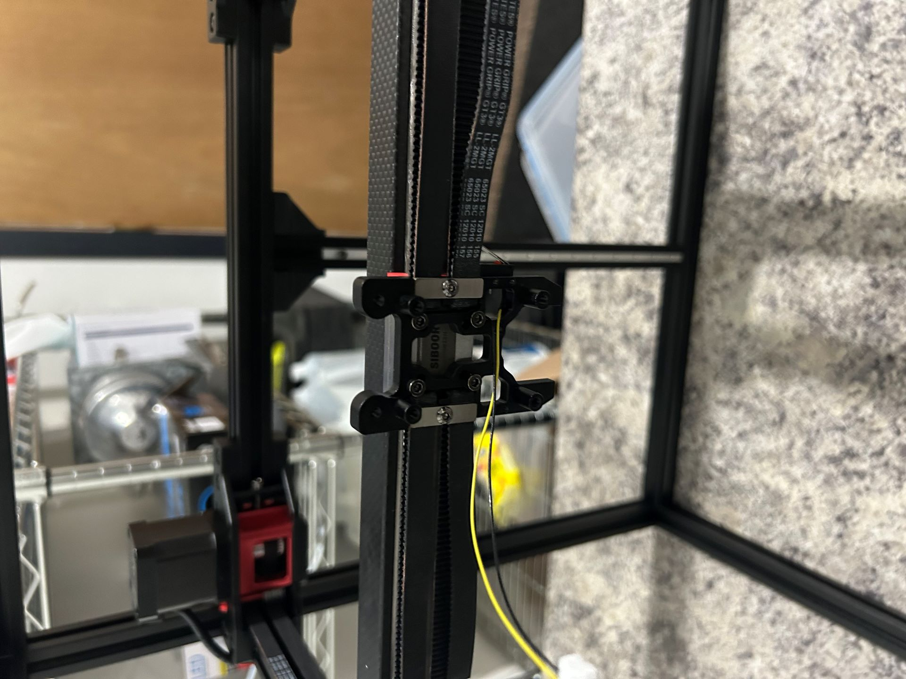
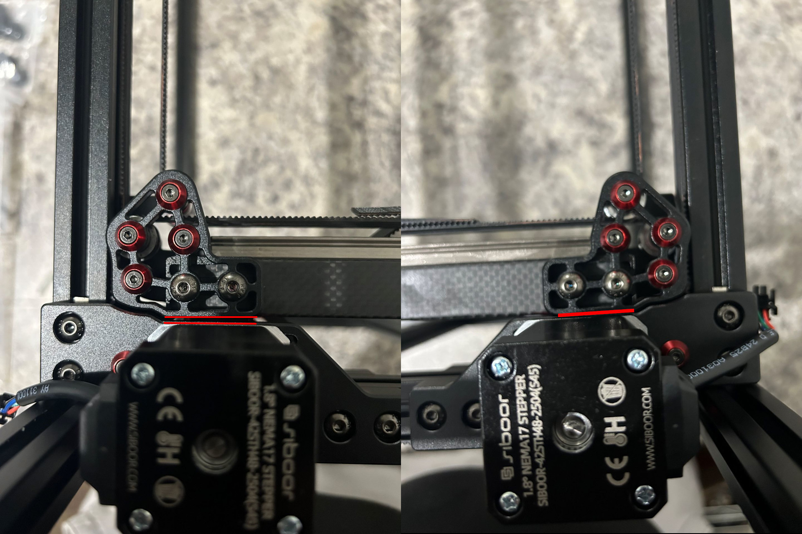

Time: 3.5 hours

The X-axis build was quick and easy, and the carbon fiber X axis is slotted on each end to allow small adjustments to the angle of the gantry. The hardest part was holding the aluminum screw backing strip while also holding the linear rail and also dropping screws into the holes. This part probably could have used a jig or perhaps another human. 

The belts, however, proved to be a bit tricky.  I'd been warned going in that its important to make sure that both belts have an equal number of teeth in the system, so I took my time making sure I cut the belt exactly in half by lining up teeth and clipping the belt together with binder clips as I went. 

Once the belts were tooth-equal, running the belts themselves was easy enough.  It took a bit of trial and error to figure out the best way of evenly tensioning the belts to the toolhead though.  I ended up evening out the top and bottom belts on one side of the toolhead, and then took slack out of the other side until it was sorta-tight and then made sure I had equal numbers of teeth on top/bottom.  I then used the tensioners on the rear Y-axis mounts to tension the belts equally.  I tested tension using a chromatic guitar tuner and just checking the Hz.  This is probably not super-accurate but should be close enough.

However, once I got things tensioned I noticed a problem.  The x-axis had racked itself during tensioning:

I verified the frame was still straight via measuring (and also checking that the opposite racking happened at the other end of the y-axis). To de-rack, I had to remove the belts and loosen the x-axis gantry.  I moved the x-axis through its motions and double-checked that there was no gap at the extremes, then tightened it back down. I re-ran the belts and this time there was no more racking after tensioning.