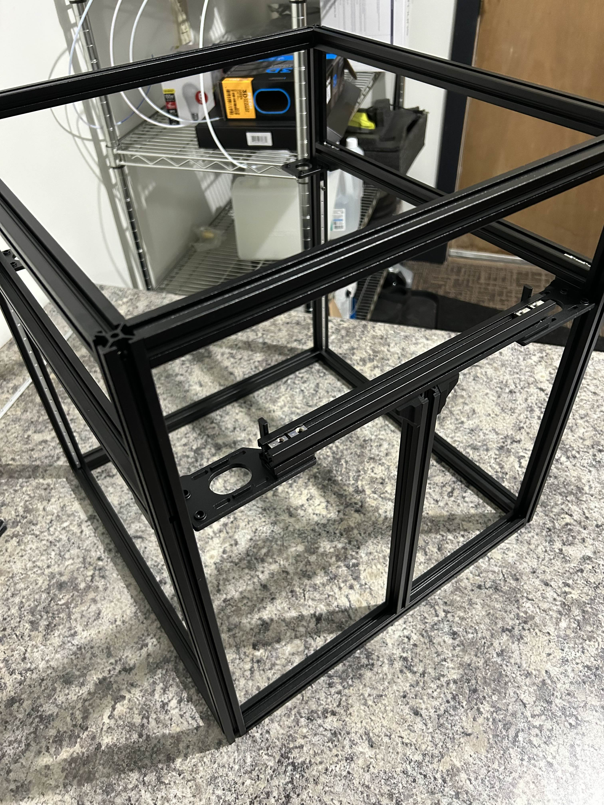
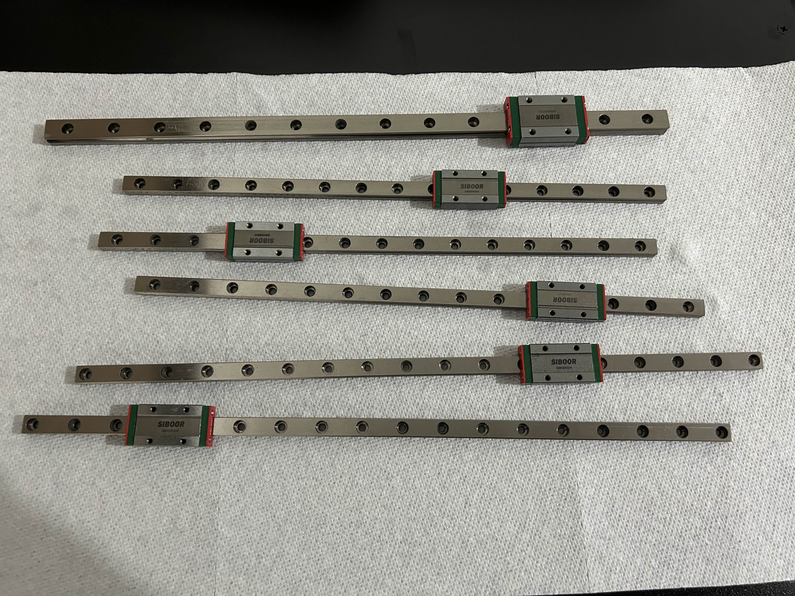
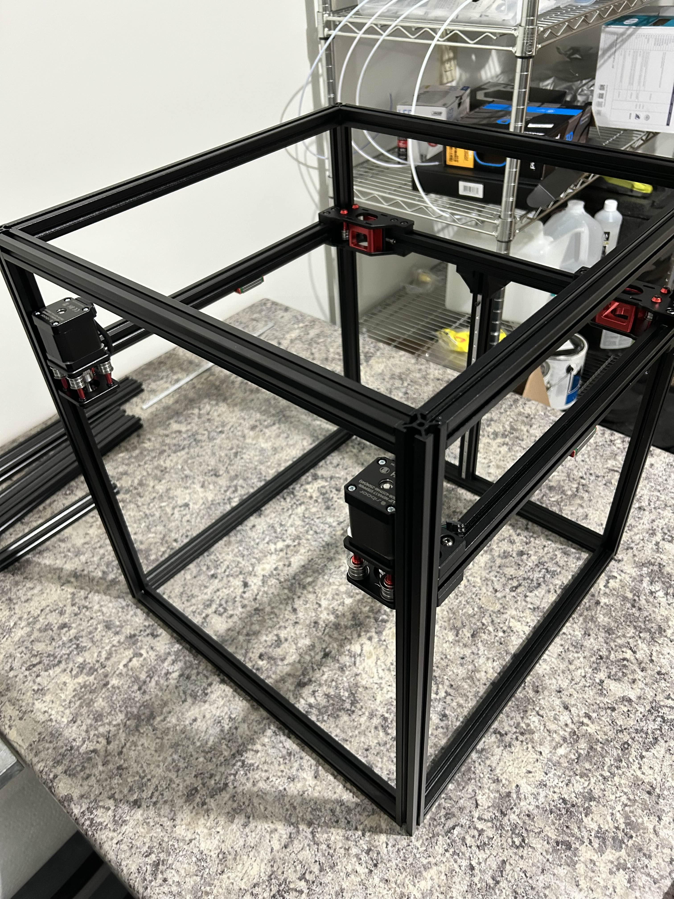
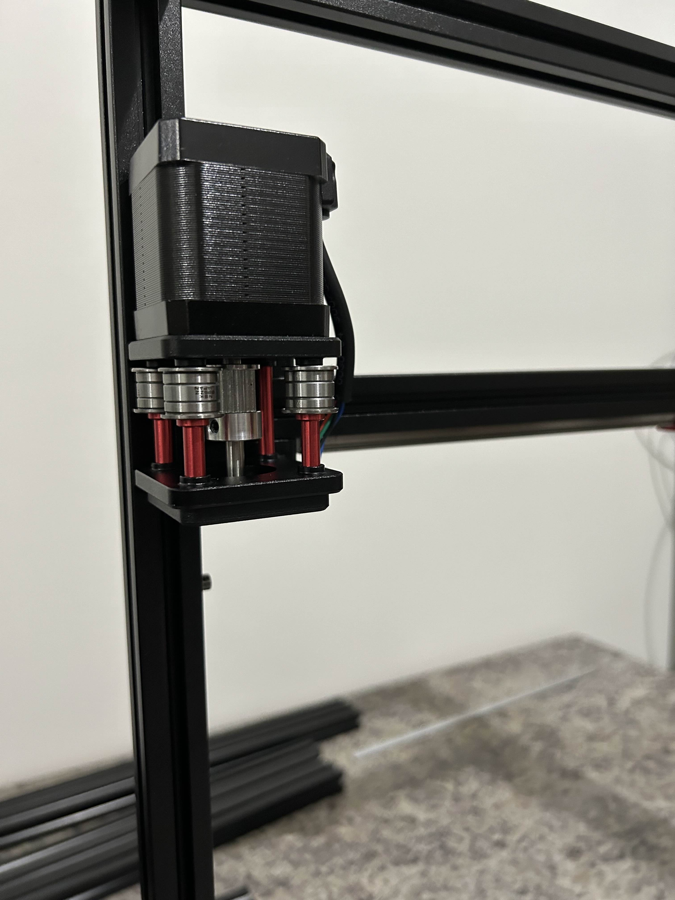
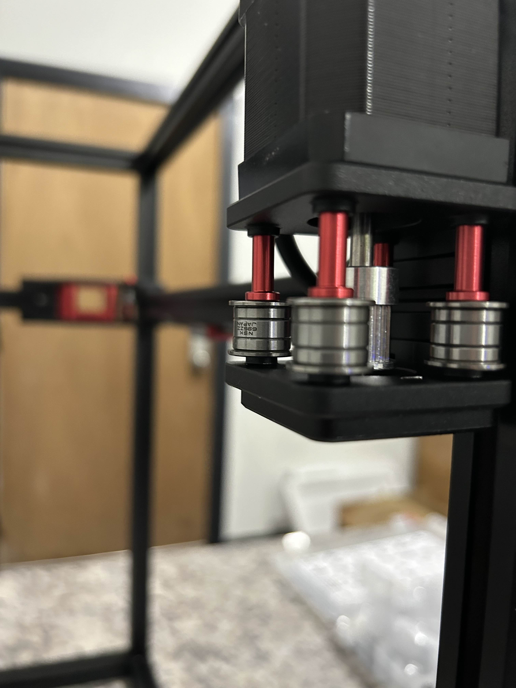
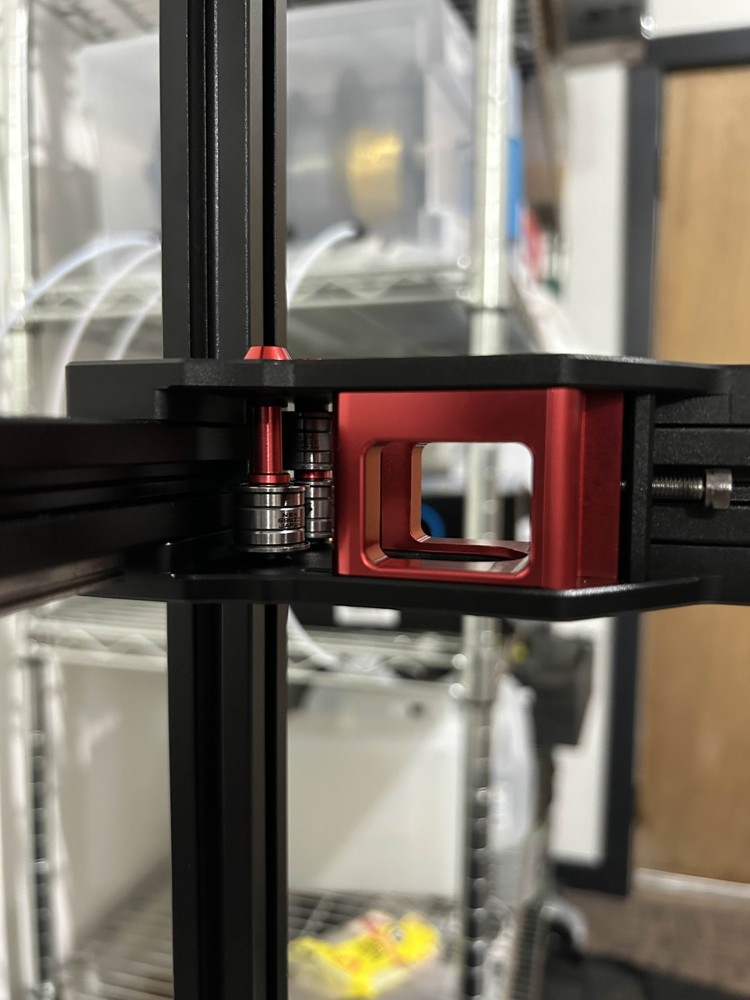
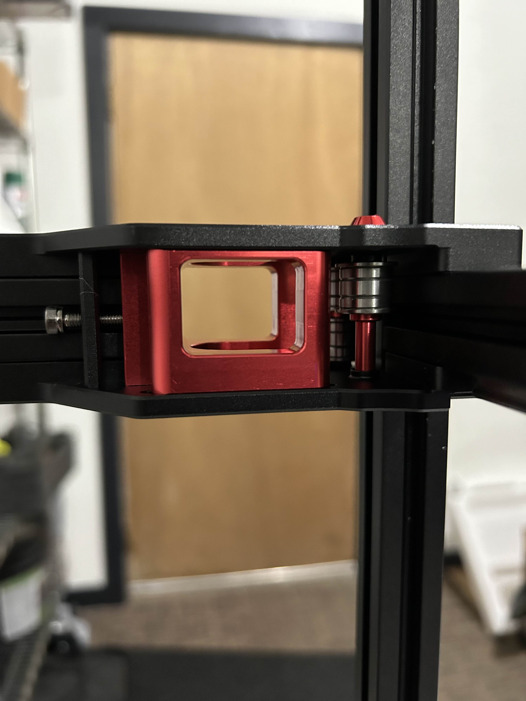

# Y-Axis

Time: 3 hours

Prepped the Y-axis frame and the bottom CNC motor brackets, and rolled in t-nuts for later.

Next took a quick aside to clean all the linear rails.  These are shipped in tool or machine oil to inhibit rust, but need to be cleaned and greased before we try to print with them.

The rails came with carriage keepers that let me remove the carriages without all the bearings falling out, so I removed each carriage as I cleaned its rail.

I hit the rails with a degreaser and paper towel, then isopropyl.  Once they were fully clean, I added the carriage back onto the rail and greased the carriage through a screw hold from behind.  I sprayed more in via several holes along the rail to try to ensure that all of the bearings and the whole raceway got a decent coating of grease.  I wiped the excess along the rest of the rail as an anti-rust measure.

All of the rails moved smoothly after greasing, and the rails themselves seem to have very little (if any) preload.

I'm using WD-40 White Lithium Grease spray. 

I mounted the Y-axis linear rails to the underside of the gantry and then mounted the bearing stacks and x0/y0 motors (the ones in front). 

On this kit, all these parts are CNC aluminum rather than printed parts.  I'm sure printed parts are fine, but I like the feel of the solid aluminum compared to ABS.

Completed Y-Axis:

X0 Motor/bearing assembly:

Y0 Motor/bearing assembly:

X1 Bearings and bracket:

Y1 Bearings and bracket:

The motors for X1/Y1 will be added when the belts are run in the next step.