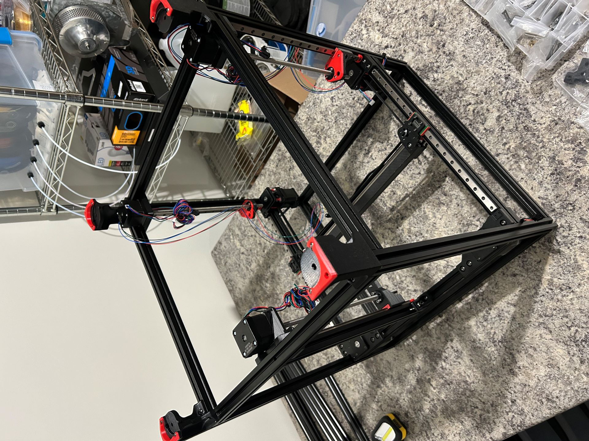

# Z-Axis

Time: 2.5 Hours

_Currently upside-down for easier Z-assembly and for adding the side skirts_

We're out of CNC parts and now we're hewing closer to the standard Voron BOM, with an exception for some cable routing for the AWD motors.

This part went together very smoothly, I think.  The only thing that tripped me up was the orientation of the rail-to-screw adapters, they look like they could be correct upside down or rightside up.  Problem quickly solved by Looking At The Manual With Eyes.

After that I added the feet, in preparation for the next step: Skirts.

## Heat Set Inserts

This section also included the first heat set inserts, so I took the time when I was all set up to just insert every one I'll need.  Siboor calls out at the beginning of the manual which pages will include heat sets so you can jump around and look at them all.  

This is something I've done only a couple times previously, but now I feel pretty comfortable with it.  Having the soldering iron in one hand and a dental pick in the other to position/hold once the iron was removed made it quick and easy to get them seated and then correctly oriented while the plastic cools.

